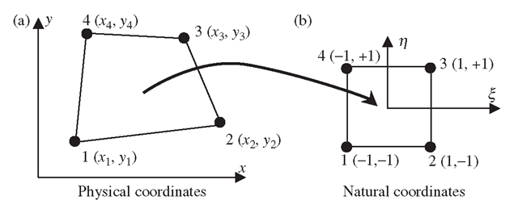
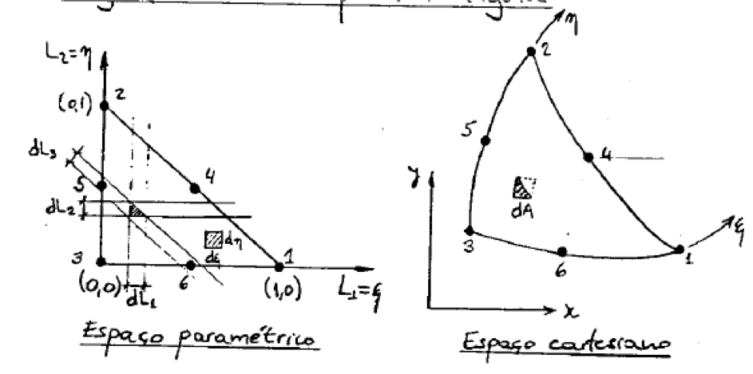

<!-- $theme: gaia -->
# FEMproject
  Trabaho Final da Disciplina de Introdução ao Metodo dos Elementos Finitos

# Autores 
  Igor de Melo Nery de Oliveira,
  Lucas Gouveia Omena Lopes

# Projeto Final

Implementação dos Elementos Finitos Q4 e T6

# Problema Estudado

Pilar submetido a carga distribuída vertical:

##  

# Elementos em Estudo 

##### Elemento Q4:
* Elemento Quadilateral de 4 nós

##  

##### Elemento T6:
* Elemento Triangular de 6 nós

##  

# Objetivos

* Implementação e uso dos elementos Q4 e t6 na resolução do problema proposto;
* Avaliação dos resultadsos e comparação dos mesmos com os do software Abaqus;

# Resultados

##### Abaqus

* Foram testados exemplos, utilizando como material o aço (Modulo de Young 200 GPa e coeficiente de Poisson 0.3), e estudados os efeitos do tipo de elemento e refinamento da malha nos resultados obtidos. Esses resultados, visulaizados através das ferramentas do software abaqus 

---

# Formulação

##### Correlação amostral (Pearson)

$$ r_{x,y} = \frac{\sum_{i=1}^n \left( x_i-u_x \right) \left( y_i-u_y \right) }{S_x S_y} $$
$$ = \frac{\sum_{i=1}^n \left( x_i y_i \right) -nu_xu_y }{n S_x S_y} $$

##  
---

# Metodologia

##### Foi realizada a correlação entre as v.a. por tubo
* avgWT: espessura média
* minWT: espessura mínima
* Ecc: excentricidade
* Ov: ovalização
* avgOD: diâmetro médio
* D/t: avgOD/minWT

# Resultados

# Resultados

##### Correlação por tubo e por v.a.

tubo x coeficiente de correlação
##  

---

# Análise dos resultados

Espera-se que a correlação entre duas v.a., caso exista, seja constante para os diferentes tubos, o que resultaria numa curva aproximandamente constante.

Ocorre grande variação desta curva para alguns pares de v.a., ainda que a média do coeficiente de correlação tenda a valores pequenos (< 10%) em alguns casos. 

Destaca-se o valor médio obtido para minWT e Ecc, indicando forte correlação negativa. Maiores valores de excentricidade levam a espessuras mínimas cada vez menores, resultado coerente.

---

# Análise dos resultados

A seguir apresentam-se gráficos com os valores dos pares de v.a., para todos os tubos. Cada ponto representa valores aferidos entre as duas v.a. na mesma seção transversal.

Cada ponto apresenta uma seção, os mesmos foram coloridos de forma a representarem seus tubos.

O gráfico a seguir demonstra a importância de realizar a análise de correlação tubo a tubo, em complemento a uma análise global, a qual pode indicar correlações equivocadas IGOR, SÃO EQUIVOCADAS MESMO? SERÁ QUE ELAS NÃO REFLETEM A REALIDADE DO PROBLEMA? VOCÊ ESCREVER ISSO ESTÁ CORRETO, PARA VALORIZAR O TUBO COMO UMA ENTIDADE ÚNICA DO PROCESSO DE MANUFATURA. PORÉM, PRECISAMOS PENSAR NO "PRODUTO" COMO UM TODO.

---

# Resultados

##### avgWT x minWT (fraca correlação linear positiva)
  
##  

---

# Resultados

##### avgWT x Ecc (não há correlação linear)

##  

---

# Resultados

##### avgWT x Ov (não há correlação linear)

##  

---
# Resultados

##### avgWT x avgOD (moderada correlação linear negativa)

##  

---
# Resultados

##### minWT x Ecc (forte correlação linear negativa)

##  

---

# Resultados

##### minWT x Ov (não há correlação linear)

##  

---

# Resultados

##### minWT x avgOD (não há correlação linear)

##  

---

# Resultados

##### Ecc x Ov (não há correlação linear)

##  

---

# Resultados

##### Ecc x avgOD (fraca correlação linear negativa)

##  

---

# Resultados

##### Ov x avgOD (fraca correlação linear negativa)

##  

---

# Resultados

##### Ov x avgOD (fraca correlação linear negativa)

##  

---

# Resultados

##### Ov x avgOD (fraca correlação linear negativa)

##  

---

# Resultados

##### Ov x avgOD (fraca correlação linear negativa)

##  

---

# Resultados

##### Ov x avgOD (fraca correlação linear negativa)

##  

---

# Resultados

##### Ov x avgOD (fraca correlação linear negativa)

##  

---
<!-- page_number: false -->

# FINAL
###### Análise de correlação entre os dados

- Avg WT x Min WT: a espessura média, calculada com base em valores mínimo e máximo daquela seção, reflete variações na espessura mínima. 

- Avg WT x Avg OD: tendência de preservar a área da seção transversal, mesmo em face da variabilidade das dimensões.

- Min WT x Ecc: correlação alta, esperada. Espessuras mínimas pequenas mostram a tendência de excentricidade na seção.

- Ov x Avg OD: a média dos diâmetros é penalizada com a ocorrência de maiores valores de ovalização.

- Ecc x Avg OD: correlação não esperada, explicada pelas correlações destas v.a. com a espessura mínima [Min WT]

###### Igor de Melo Nery Oliveira
###### Editado em: 13/06/2018

## Referencias até o momento

[Eigen Website - Instalation](http://eigen.tuxfamily.org/index.php?title=IDEs#Visual_Studio)
