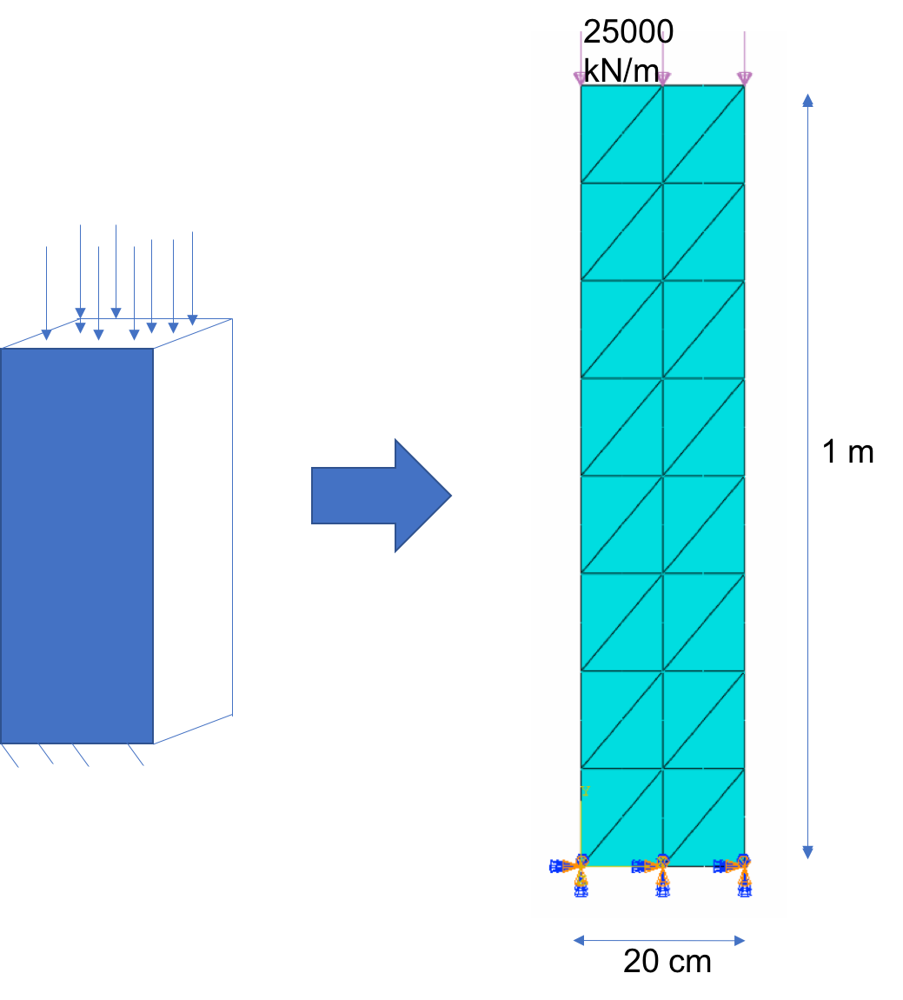

<!-- $theme: gaia -->
# FEMproject
  Trabaho Final da Disciplina de Introdução ao Método dos Elementos Finitos

# Autores 
  * Igor de Melo Nery de Oliveira
  * Lucas Gouveia Omena Lopes

# Projeto Final

* Implementação dos Elementos Finitos Q4 e T6 para resolução de um problema de uma estrutura submetida ao estado plano de tensões.

# Problema Estudado

Pilar engastado na base, e submetido a uma carga distribuída vertical no topo:

##  

# Elementos em Estudo 

##### Elemento Q4:
* Elemento Quadilateral de 4 nós

##  

##### Elemento T6:
* Elemento Triangular de 6 nós

##  

# Objetivos

* Implementação e uso dos elementos Q4 e T6 na resolução do problema proposto;
* Avaliação dos resultadsos e comparação dos mesmos com os do software Abaqus.

# Resultados

## Implementação Computacional dos Elementos T6 e Q4

* As implementações dos elementos, juntamente com um código de análise de problemas usando o Método dos Elementos Finitos, foram feitas fazendo-se uso da linguagem de programação C++;
* Os códigos e documentações seguem junto a esse PDF, podendo ser acessados de maneira iterativa através do arquivo HTML, onde toda documentação e comentários se encontram.
* A implementação apresentada faz uso do arquivo de entrada do software comercial Abaqus, afim de tirar proveito da ferramenta de geração de malhas do mesmo;
* Os resultados obtidos através dessa implementação são verificados através do Abaqus, e serão apresentados posteriormente.

## Abaqus

* Foram testados exemplos, utilizando como material o aço (Modulo de Young 200 GPa e coeficiente de Poisson 0.3), e estudados os efeitos do tipo de elemento e refinamento da malha nos resultados obtidos. Esses resultados, visulaizados através das ferramentas do software Abaqus. Os campos avaliados foram os deslocamentos (U),tensões (S), reações de apoio (RF) e deformações na estrutura (E).

## Deslocamentos
###  

## Tensões
###  

## Reações
###  

## Defromações
###  

## Número de Elementos x Deslocamentos 

[

# Análise dos resultados

## Referencias até o momento

[Eigen Website - Instalation](http://eigen.tuxfamily.org/index.php?title=IDEs#Visual_Studio)
